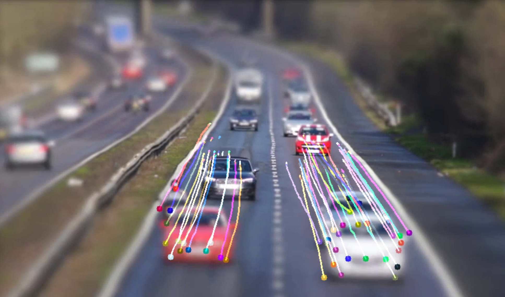
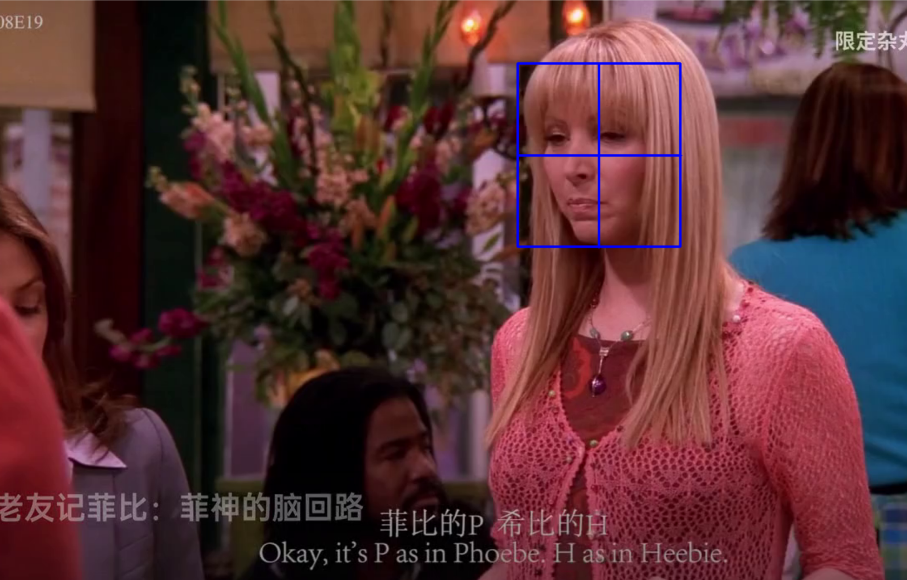
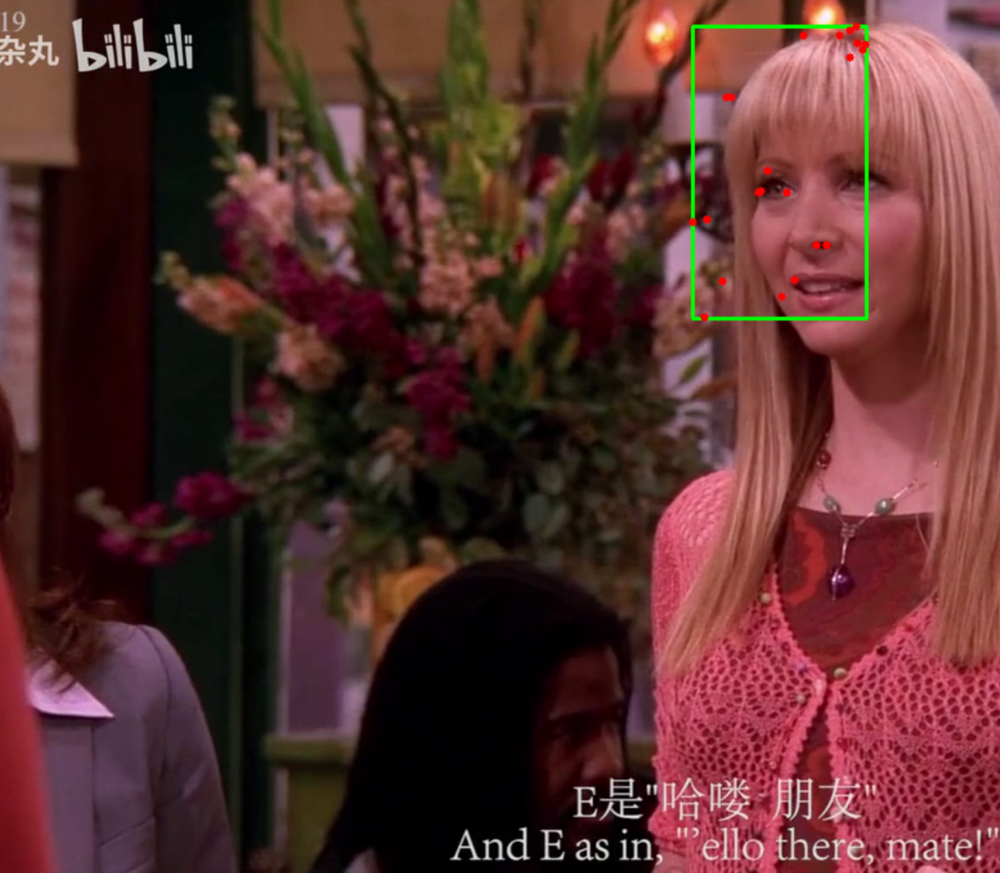

# 光流法目标追踪

原理在Flow US中

# carFlow.py

**删除静止点的光流分析：**

**实现流程：**

- 加载视频。

- 调用`cv2.GoodFeaturesToTrack` 函数寻找兴趣点（关键点）。

- 调用`cv2.CalcOpticalFlowPyrLK` 函数计算出两帧图像中兴趣点的移动情况。

- 删除未移动的兴趣点。

- 在两次移动的点之间绘制一条线段

  

# slectToTrack.py

运行用户在第一帧图片中框选目标得到目标在第一帧图像中的初始位置

计算特征点

然后进行光流法得到下一帧中目标特征点位置

并且用矩形框绘制将下一帧中图像框出。

